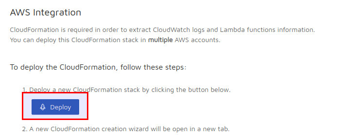
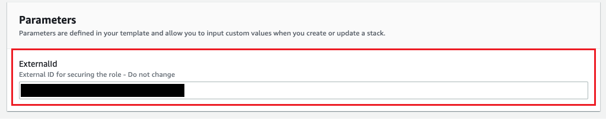

# Install the Epsagon Cloud Formation Stack with CDK

## Obtain the `External Id`

To find the right value to set for the External ID Epsagon parameter, go to your [Epsagon settings](https://dashboard.epsagon.com/settings/cloudformation) and click the CloudFormation deploy button:



Then copy the `ExternalID` into your Terraform file:



## How to use it

```
$ cdk bootstrap
```

Then, run

```
EXTERNAL_ID=<YOUR EXTERNAL ID> cdk deploy
```
to deploy the stack.

## Integrating this example into your own CDK Project

1. Copy over `resources/epsagon_template.json` into your project
2. Copy over `lib/install-epsagon-cf-stack-stack.ts` into your project
3. Copy over `bin/install-epsagon-cf-stack.ts` into your project
4. In `bin/install-epsagon-cf-stack.ts`:
   1. Adjust the `env` object and configure your AWS Account ID and region
5. Run `npm install @aws-cdk/cloudformation-include`

## License

MIT